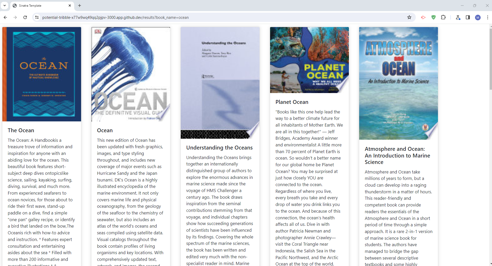

# BookPedia

## Description

BookPedia is a simple Mini-project Book search engine powered by Google, it allows user to search for thier favorite books and it allow them to read a preview.

## Usage

By creating BookPedia, my goal is simplify the process of picking a valuable books to read and expand knowledge.I also wanted to implement what i learened from this curricullam.

## used Technologies
- Sinatra ,Ruby , HTTParty Gem , JSON GEM, Bootstrap, GoogleBooksAPI

## Credit
-ask GPT
-ChatGPT

## github link
https://github.com/melhelow/BookSearchEngine

## Deployed link
https://bookpedia-y8ss.onrender.com/
